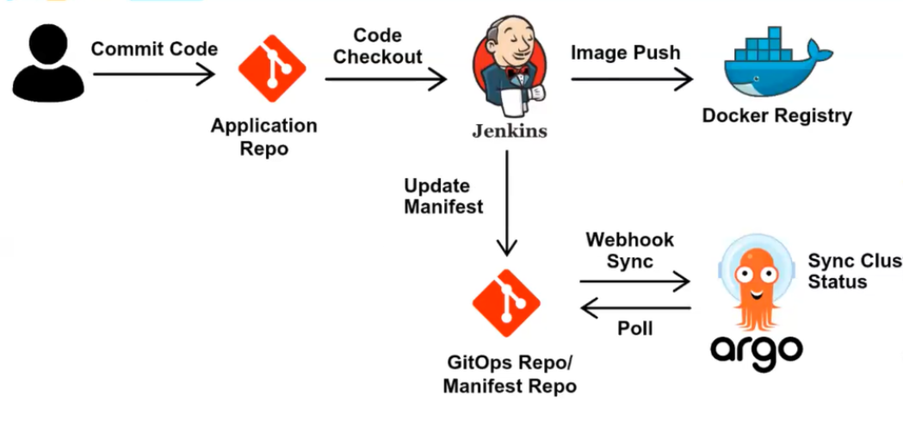

# DevOps

This repository is the DevOps for the inventory application. Here you can find
the files for CI/CD.

The CI was implemented with Jenkins (maybe we will change it to GitHub Action
in the future).

The CD was implemented with Argo CD.

## Jenkins

More details about our implementation for the CI with Jenkins see in
[Jenkins](jenkins/README.md) directory

## Argo CD

More details about our implementation for CD with ArgoCD see in
[Argo CD](argocd/README.md) directory
