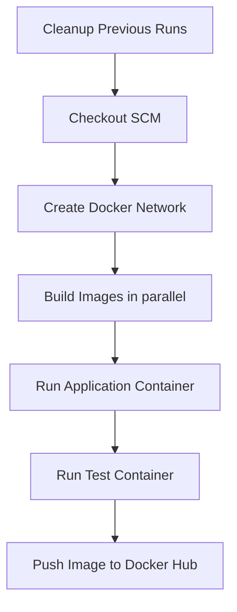

# Jenkins

The CI was implemented with Jenkins (maybe we will change it to GitHub Action
in the future).

## The Pipeline

The Jenkins server must have docker installation in it.

In our case, the Jenkins server didn't have docker-compose and pytest, so we
created a test container which execute the test with pytest.

The post build cleans up all the docker resources (containers and network).

## Pre-run Settings

The pipeline uses some plugins and credentials. You MUST set them before running the pipeline.

### Plugins

We installed the following plugins:

* SCM Skip
* Git Push
* Docker plugin
* Ant Plugin
* Build Timeout
* Docker Pipeline
* docker-build-step
* Email Extension
* GitHub Branch Source
* Gradle Plugin
* LDAP Plugin
* Matrix Authorization Strategy Plugin
* PAM Authentication plugin
* Pipeline
* Pipeline Graph View
* Pipeline: GitHub Groovy Libraries
* Pipeline: Stage View Plugin
* Timestamper
* Wrkspace Cleanup Plugin

### Credentials

You need to create 2 credentials: one for docker hub and another one for GitHub.

#### Credentials for Docker Hub

The instruction to create token for docker hub are here: https://docs.docker.com/security/for-developers/access-tokens/

The ID for the docker hub credentials in Jenkins should be `yakinew-docker-login`.

#### Credentials for GitHub

To create token for GitHub go to https://github.com/settings/tokens.

The ID for the GitHub credentials in Jenkins should be `yakinew_github_jenkins`.
