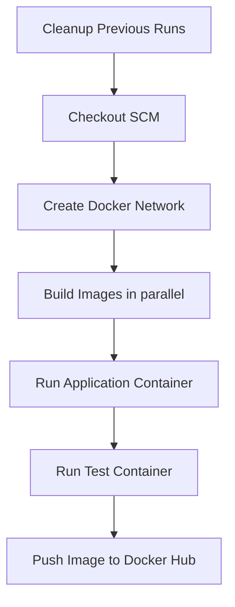

# Jenkins

The CI was implemented with Jenkins (maybe we will change it to GitHub Action
in the future).

## The Pipeline

The Jenkins server must have docker installation in it.

In our case, the Jenkins server didn't have docker-compose and pytest, so we
created a test container which execute the test with pytest.

The post build cleans up all the docker resources (containers and network).
